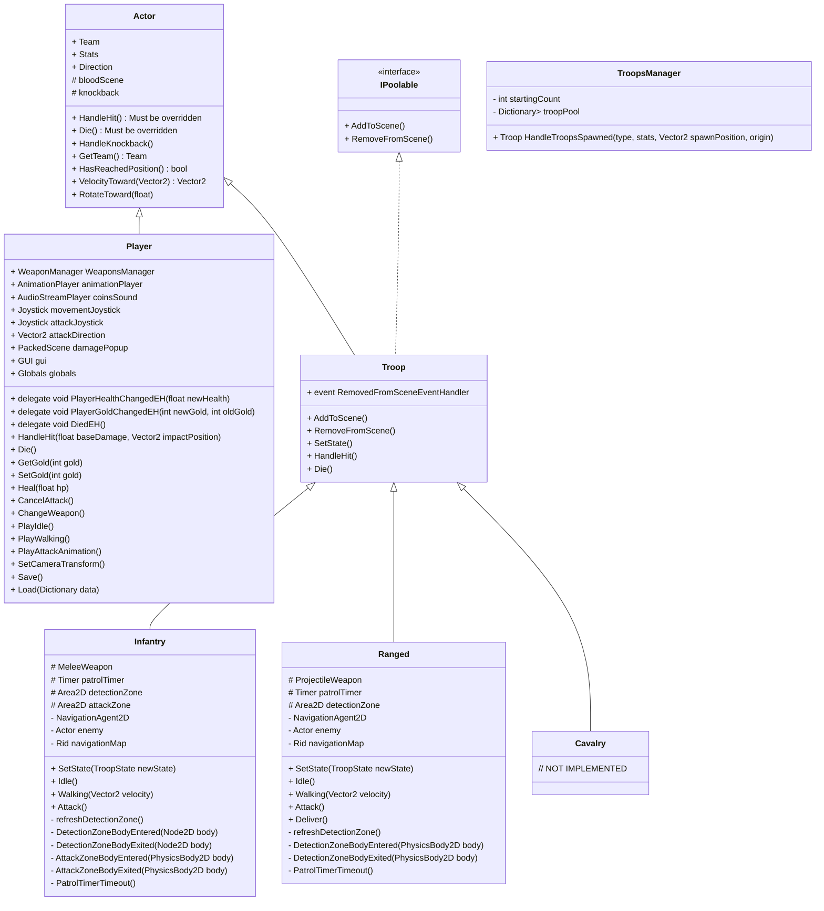
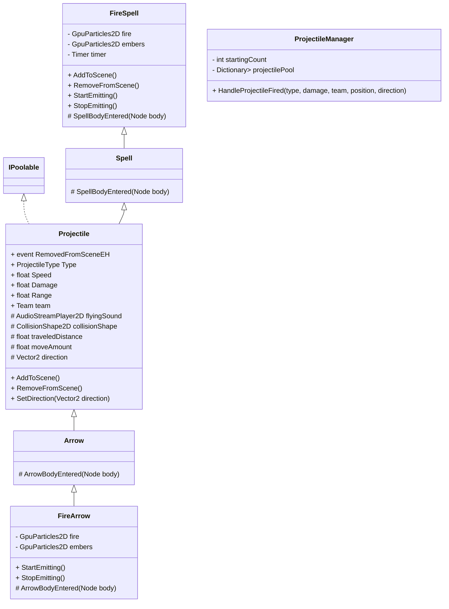
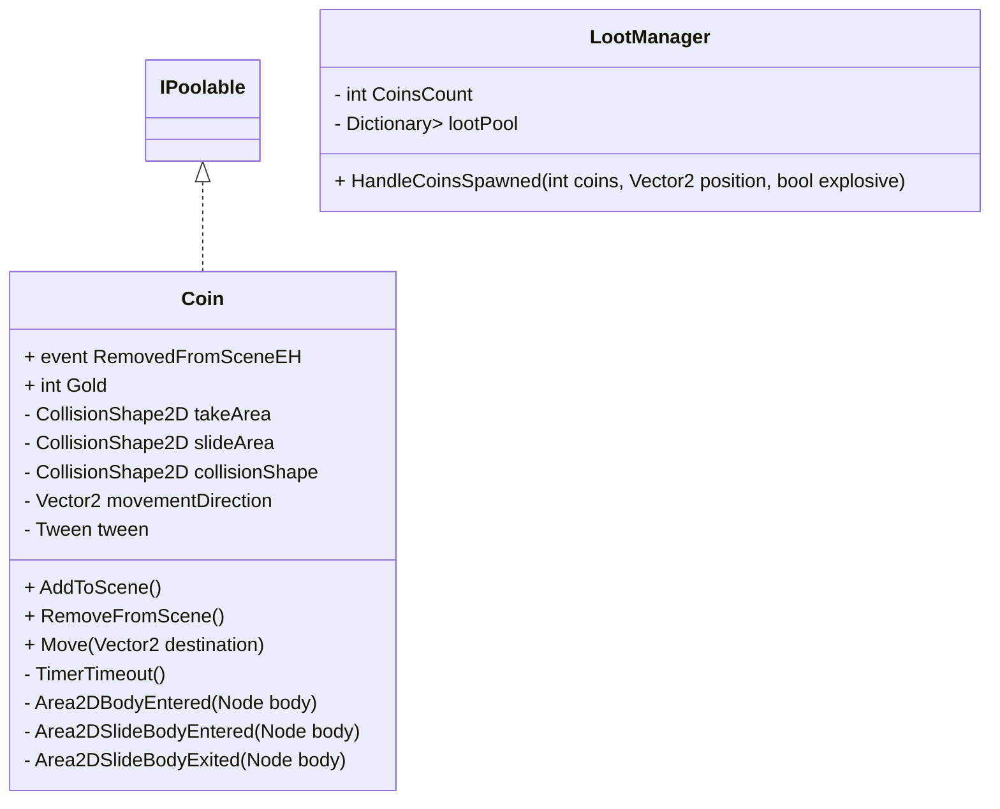
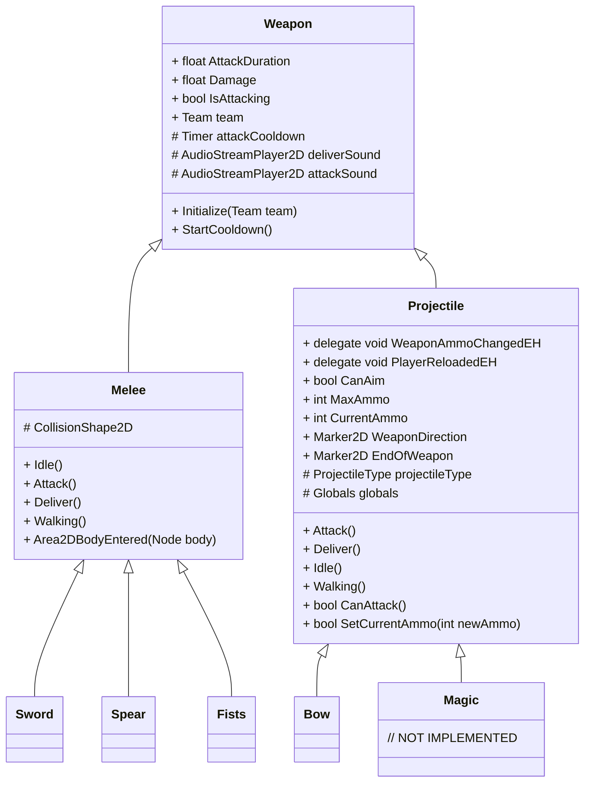

# Code base
_____________________
## Object pooling

Any object that is added to the scene multiple times during gameplay (e.g., projectiles, NPCs, collectables) should inherit from the `IPoolable` interface. This interface minimizes the overhead of adding and removing objects by enabling objects to be added once, which are hidden and reused as needed.

The `ObjectPool` expands dynamically. In future versions, it should also support dynamic shrinking to conserve memory—ideally triggered during events like saving/loading or cutscenes to reduce performance impact.

## Actors

## Projectiles

## Loot

## Weapons

# Material
______________________
## Sprites

## Animations

## Shaders

